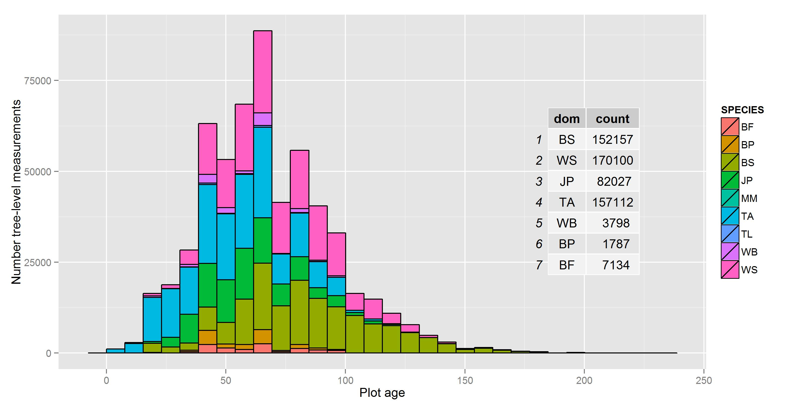

# FIGURES

\newpage

## Figure 1. Our study areas: the managed forests of Saskatchewan and the Prince Albert Forest Management Area.


\newpage

## Figure 2. Analyses inputs and flow.


\newpage

## Figure 3. Tree-level measurements over plot age, by species for plots used for biomass prediction.



\newpage

## Figure 4. Average (blue dot) and measurement range (wings) of biomass measured in permanent sample plots in each year that field data were collected. The size of the dot indicates the total number of plots measured in each year.
```{r echo=FALSE, message=FALSE,warning=FALSE,fig.width=8, fig.height=5}
library(data.table)
library(ggplot2)
indir = "M:/Spatially_explicit/01_Projects/07_SK_30m/Working/CBoisvenue/CleanedUpForUsing/"
biom.ha.psp <- fread(paste(indir,"SK_2000Biomass_ha.txt",sep=""),sep=",", header=TRUE)
# range(biom.ha.psp$biom.ha)
# [1]   2.77457 464.03525
# the above is not what I give in the manuscripts...

#there are gaps in Figure 4, they were cheked and they are really gaps in the data
# Repeating Fig.4 with the SK_2000Biomass_ha.txt, instead of the calculated ones I originally used
pspAvgBiom.yr <- biom.ha.psp[,.(mean=mean(biom.ha),sd=sd(biom.ha),no.plot=.N),by=YEAR]
pspAvgBiom.yr <- pspAvgBiom.yr[!is.na(sd)]
fig4 <- ggplot(data=pspAvgBiom.yr,aes(YEAR,mean))
fig4 + geom_point(aes(size=no.plot),colour="blue") + ylab("Mg/ha") + 
  geom_errorbar(aes(ymin=(mean)-1.96*(sd),ymax=(mean)+1.96*(sd)))


```

\newpage

## Figure 5. Average yearly aboveground biomass across pixels (in black) for the pixel-based  estimates that remain undisturbed from 1984 to 2012 for each year, and estimates from the field plots (red).
```{r echo=FALSE, message=FALSE,fig.width=8, fig.height=5}
library(data.table)
library(ggplot2)
raster.biom <- fread("M:/Spatially_explicit/01_Projects/07_SK_30m/Working/growth/biomassHaEvaluation/RasterAvg_SD.txt",sep="\t",header=TRUE)
setnames(raster.biom,names(raster.biom),c("YEAR","mean","sd"))
# add PSP info from Figure 4
indir <- "M:/Spatially_explicit/01_Projects/07_SK_30m/Working/CBoisvenue/CleanedUpForUsing/"
biom.ha.psp <- fread(paste(indir,"SK_2000Biomass_ha.txt",sep=""),sep=",", header=TRUE)
pspAvgBiom.yr <- biom.ha.psp[,.(mean=mean(biom.ha),sd=sd(biom.ha),no.plot=.N),by=YEAR]
pspAvgAGB84 <- pspAvgBiom.yr[YEAR>1983]
pspAvgAGB84 <- pspAvgAGB84[,no.plot := NULL]
allABG.ha.yr <- rbind(raster.biom,pspAvgAGB84)
Source <- c(rep("pixel",dim(raster.biom)[1]),rep("PSP",dim(pspAvgAGB84)[1]))
allABG.ha.yr <- cbind(allABG.ha.yr,Source)

fig5 <- ggplot(data=allABG.ha.yr,aes(YEAR,mean,group=Source,colour=Source, fill=Source)) + 
  geom_point() + geom_line() + geom_errorbar(aes(ymin=(mean)-1.96*(sd),ymax=(mean)+1.96*(sd)))+
  scale_colour_manual(values=c("black", "red"))
fig5
```

\newpage

## Figure 6. Checking the assumptions for the linear mixed effect model fit to field plots. Top panel: residuals for the linear mixed effects model of biomass increment fit to the field data. Bottom panel: quantile plot comparing the random effect residuals for mixed effect model fit to field plot data to a normal distribution.
```{r echo=FALSE,message=FALSE,warning=FALSE,fig.width=8, fig.height=5}
library(lme4)

# load the model, it is names mem7
load(file = "M:/Spatially_explicit/01_Projects/07_SK_30m/Working/growth/MEM_t_haPSP/MEM_t_ha.Rdata")

library (ggplot2)
error1 <- as.data.frame(cbind(c(1:1353),residuals(mem7)))
names(error1) = c("Index","Error")
plot.er1 <- ggplot(data=error1, aes(Index,Error)) + geom_point(size=2) +
  geom_hline(aes(yintercept=0),size=1)
error2 <- as.data.frame(ranef(mem7)$PLOT_ID)
names(error2) <- "Intercept"
plot.er2 <- ggplot(data=error2,aes(sample=Intercept)) +stat_qq(shape=1) +
  geom_abline(intercept = mean(error2$Intercept), slope = sd(error2$Intercept), size=1) 
plot.er1
plot.er2

```

\newpage

## Figure 7. Predicted biomass per ha increments (MgC/ha) from the mixed effect model fit on the field-based for each of nine strata modelled.


```{r echo=FALSE,message=FALSE,warning=FALSE}
# Not sure why this did not work
#library(lme4)

# load the model, it is names mem7
#load(file = "M:/Spatially_explicit/01_Projects/07_SK_30m/Working/growth/MEM_t_haPSP/MEM_t_ha.Rdata")

#library (ggplot2)

#plot.age <- rep(1:250) #this is my x-axis
#l.age <-log(plot.age) # in the right transmormation
#topredMM <- as.data.frame(cbind(plot.age,l.age)) # put them together
#names(topredMM) = c("age1","l.age") # name them the same this as in the fitting data
#stratum <- sort(rep(c("BF","BP","BSG","BSM","JP","TAG","TAM","WB","WSG"),250)) # same number of 
# strata as in the fit.data
#topredMM <- cbind(stratum,topredMM)
#names(topredMM) = c("stratum","age1","l.age") # name them the same this as in the fitting data
#NoWSMlhat2 <- predict(mem7,newdata=topredMM)
#NoWSMhat2 <- exp(NoWSMlhat2)
#NoWSMpred2 <- cbind(topredMM,NoWSMhat2,NoWSMlhat2)
#fig7 <- ggplot(data=NoWSMpred2,aes(x=age1,y=NoWSMhat2,group=stratum,colour=stratum,linetype=stratum)) + 
#  geom_line(size=1) + xlab("Age") + ylab("MgC/ha") + theme(legend.position=c(0.9,0.62))
#fig7

```


\newpage

## Figure 8. Parameter values resulting from fitting the log of Hoerl's fucntion to field-based observations (purple) of biomass change for the PAFMA in Saskatchewan Canada compared to the range of parameter values obtained by fitting the log of Hoerl's function to 100 samples of pixel-based estimates of yearly biomass change. The top panel shows the intercept values for each of the nine strata, and the bottom panel shows the parameter values for the slopes, nine for b1 (one per strata) and one for b2 (x-label "ALL").
```{r echo=FALSE,message=FALSE,warning=FALSE,fig.width=8, fig.height=5}
library(data.table)
library(ggplot2)

# Read in both parameter estimates
#-----------------------------------------
data.in = "M:/Spatially_explicit/01_Projects/07_SK_30m/Working/CBoisvenue/CleanedUpForUsing/"

psp <- fread(paste(data.in,"BiomModelParamsCI.txt",sep=""),sep=",",header=TRUE)
setkey(psp,stratum,b)
rs <-  fread(paste(data.in,"DeltaBiomRsParams.txt",sep=""),sep=",",header=TRUE)
setkey(rs,stratum,b)
b0.modes <- read.table(file=paste(data.in,"b0RSmodes.txt",sep=""),sep=",",header=TRUE)
b1.modes <- read.table(file=paste(data.in,"b1RSmodes.txt",sep=""),sep=",",header=TRUE)
b2.modes <- read.table(file=paste(data.in,"b2RSmodes.txt",sep=""),sep=",",header=TRUE)
stratum <- "ALL"
b2.mode <- as.data.frame(cbind(stratum,b2.modes))

# End of reading in data -------------------------

# Compare one parameter type at a time
#-----------------------------------------------------------------

# graphically compare the intercepts only
b0psp <- psp[.(stratum,"b0")][stratum!="ALL"]
b0rs <- rs[b=="b0"]


b0.plot <- ggplot(data=b0psp, aes(y=value,x=stratum)) + 
  geom_errorbar(aes(ymin=lower.b,ymax=upper.b), width=.2,colour="purple") + geom_point(colour="purple") +
  geom_boxplot(data=b0rs,aes(x=stratum,y=value,alpha=0.2)) +
  theme(legend.position="none") +
  #ggtitle("Intercept values comparison, RS and PSP") +
  theme(plot.title=element_text(face="bold",size=20)) + theme_gray() 
  
b0.plot + geom_point(data=b0.modes,aes(x=stratum,y=mode,colour="red", size=2)) +theme(legend.position="none")

# second graph
b1psp <- psp[b=="b1" | b=="b2"]
b1rs <- rs[b=="b1" | b=="b2"]

b1.plot <- ggplot(data=b1psp, aes(y=value,x=stratum)) + 
  geom_errorbar(aes(ymin=lower.b,ymax=upper.b), width=.2,colour="purple") + geom_point(colour="purple") +
  geom_boxplot(data=b1rs,aes(x=stratum,y=value,alpha=0.2)) +
# theme(legend.position="none") +
#  ggtitle("Slope for logAge comparison, RS and PSP") +
  theme(plot.title=element_text(face="bold",size=20)) + theme_gray()
b1.plot2 <- b1.plot + geom_point(data=b1.modes,aes(x=stratum,y=mode,colour="red", size=2))+ theme(legend.position="none")
b1.plot2 + geom_point(data=b2.mode,aes(x=stratum,y=mode,colour="red", size=2))+ theme(legend.position="none")
```

