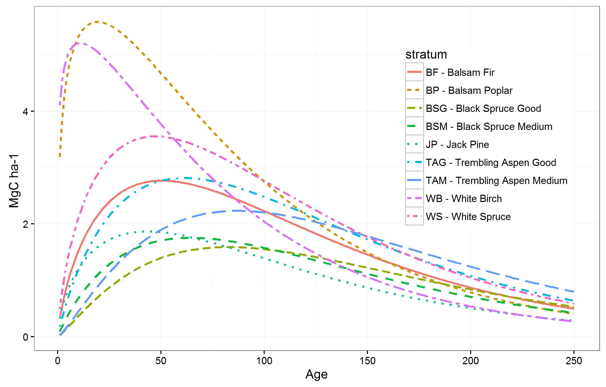

# FIGURES

\newpage

## Figure 1. Our study areas: the managed forests of Saskatchewan and the Prince Albert Forest Management Area.


\newpage

## Figure 2. Analyses inputs and flow.


\newpage

## Figure 3. Tree-level measurements over plot age in the re-measured permanent field plots, by species for plots used for biomass prediction.


```{r echo=FALSE, warning=FALSE, message=FALSE, error=FALSE, fig.width=8, fig.height=5}
library(data.table)
library(ggplot2)
library(plyr)
library(dplyr)
indir = "M:/Spatially_explicit/01_Projects/07_SK_30m/Working/CBoisvenue/CleanedUpForUsing/"

psp.tree <- fread(paste(indir,"SK_2000TreeMeasurements.csv",sep=""),sep=",",header=TRUE)
no.meas.psp <- psp.tree[,.(count = .N),by=dom]
# better plot with a table
library(gridExtra)
# addressing Rev1 comment
# get rid of MM and TL
psp.tree <- psp.tree[SPECIES!="MM"]
psp.tree <- psp.tree[SPECIES!="TL"]
psp.tree$SPECIES <- mapvalues(psp.tree$SPECIES,unique(psp.tree$SPECIES),c("Black Spruce","White Spruce","Balsam Poplar","White Birch","Trembling Aspen","Jack Pine","Balsam Fir"))

g <- ggplot(data=psp.tree) + geom_histogram(aes(round(age), fill=SPECIES),colour="black") +
  xlab("Plot age") + ylab("Number tree-level measurements") 

#ggtitle("Measured Trees by Age and Species - SK 418") + 
#theme(plot.title = element_text(lineheight=1.2, face="bold"))
g+annotation_custom(tableGrob(no.meas.psp),xmin=175, xmax=225,ymin=14000,ymax=75000) +
  theme_bw() + scale_fill_discrete(breaks=c("Black Spruce","White Spruce","Jack Pine","Trembling Aspen","White Birch","Balsam Poplar","Balsam Fir")) + theme(legend.position=c(0.6,0.52),legend.key.size = unit(1.5, "lines")) #legend.text = element_text(size = 14)
```

\newpage

## Figure 4. Average (blue dot) and measurement range (wings) of biomass measured in permanent sample plots in each year that field data were collected. The size of the dot indicates the total number of plots measured in each year.
```{r echo=FALSE, message=FALSE,warning=FALSE,fig.width=8, fig.height=5}
library(data.table)
library(ggplot2)
indir = "M:/Spatially_explicit/01_Projects/07_SK_30m/Working/CBoisvenue/CleanedUpForUsing/"
biom.ha.psp <- fread(paste(indir,"SK_2000Biomass_ha.txt",sep=""),sep=",", header=TRUE)
# range(biom.ha.psp$biom.ha)
# [1]   2.77457 464.03525
# the above is not what I give in the manuscripts...

#there are gaps in Figure 4, they were cheked and they are really gaps in the data
# Repeating Fig.4 with the SK_2000Biomass_ha.txt, instead of the calculated ones I originally used
pspAvgBiom.yr <- biom.ha.psp[,.(mean=mean(biom.ha),sd=sd(biom.ha),no.plot=.N),by=YEAR]
pspAvgBiom.yr <- pspAvgBiom.yr[!is.na(sd)]
fig4 <- ggplot(data=pspAvgBiom.yr,aes(YEAR,mean))
fig4 + geom_point(aes(size=no.plot),colour="blue") + ylab("Mg/ha") + 
  geom_errorbar(aes(ymin=(mean)-1.96*(sd),ymax=(mean)+1.96*(sd))) +
  theme_bw()


```

\newpage

## Figure 5. Average yearly aboveground biomass across pixels (in black) for the pixel-based  estimates that remain undisturbed from 1984 to 2012 for each year, and estimates from the field plots (red).
```{r echo=FALSE, message=FALSE,fig.width=8, fig.height=5}
library(data.table)
library(ggplot2)
raster.biom <- fread("M:/Spatially_explicit/01_Projects/07_SK_30m/Working/growth/biomassHaEvaluation/RasterAvg_SD_constantPixels.txt",sep=",",header=TRUE)
setnames(raster.biom,names(raster.biom),c("YEAR","mean","sd"))
# add PSP info from Figure 4
indir <- "M:/Spatially_explicit/01_Projects/07_SK_30m/Working/CBoisvenue/CleanedUpForUsing/"
biom.ha.psp <- fread(paste(indir,"SK_2000Biomass_ha.txt",sep=""),sep=",", header=TRUE)
pspAvgBiom.yr <- biom.ha.psp[,.(mean=mean(biom.ha),sd=sd(biom.ha),no.plot=.N),by=YEAR]
pspAvgAGB84 <- pspAvgBiom.yr[YEAR>1983]
pspAvgAGB84 <- pspAvgAGB84[,no.plot := NULL]
allABG.ha.yr <- rbind(raster.biom,pspAvgAGB84)
Source <- c(rep("pixel",dim(raster.biom)[1]),rep("PSP",dim(pspAvgAGB84)[1]))
allABG.ha.yr <- cbind(allABG.ha.yr,Source)

fig5 <- ggplot(data=allABG.ha.yr,aes(YEAR,mean,group=Source,colour=Source, fill=Source)) + 
  geom_point() + geom_line() + geom_errorbar(aes(ymin=(mean)-1.96*(sd),ymax=(mean)+1.96*(sd)))+
  ylab("Mg/ha") +
  scale_colour_manual(values=c("black", "red"))
fig5 +theme_bw()
```

```{r echo=FALSE,message=FALSE,warning=FALSE,fig.width=8, fig.height=5}
# library(lme4)
# 
# # load the model, it is names mem7
# load(file = "M:/Spatially_explicit/01_Projects/07_SK_30m/Working/growth/MEM_t_haPSP/MEM_t_ha.Rdata")
# 
# library (ggplot2)
# error1 <- as.data.frame(cbind(c(1:1353),residuals(mem7)))
# names(error1) = c("Index","Error")
# plot.er1 <- ggplot(data=error1, aes(Index,Error)) + geom_point(size=2) +
#   geom_hline(aes(yintercept=0),size=1)
# error2 <- as.data.frame(ranef(mem7)$PLOT_ID)
# names(error2) <- "Intercept"
# plot.er2 <- ggplot(data=error2,aes(sample=Intercept)) +stat_qq(shape=1) +
#   geom_abline(intercept = mean(error2$Intercept), slope = sd(error2$Intercept), size=1) 
# plot.er1 +theme_bw()
# plot.er2 +theme_bw()

```

\newpage

## Figure 6. Predicted biomass per ha increments per year (MgC ha^-1^ yr^-1^) from the mixed effect model fit on the field-based tree measurements for each of nine strata modelled.



\newpage

## Figure 7.Parameter values resulting from fitting the log of Hoerl's fucntion to field-based observations (purple) of biomass change for the PAFMA in Saskatchewan Canada compared to the range of parameter values obtained by fitting the log of Hoerl's function to 100 samples (280 000 observations per sample) of pixel-based estimates of yearly biomass change. The top panel shows the intercept values for each of the nine strata, and the bottom panel shows the parameter values for the slopes, nine for b1 (one per strata) and one for b2 (x-label "ALL").
```{r echo=FALSE,message=FALSE,warning=FALSE,fig.width=8, fig.height=5}
library(data.table)
library(ggplot2)

# Read in both parameter estimates
#-----------------------------------------
data.in = "M:/Spatially_explicit/01_Projects/07_SK_30m/Working/CBoisvenue/CleanedUpForUsing/"

psp <- fread(paste(data.in,"BiomModelParamsCI.txt",sep=""),sep=",",header=TRUE)
setkey(psp,stratum,b)
rs <-  fread(paste(data.in,"DeltaBiomRsParams.txt",sep=""),sep=",",header=TRUE)
setkey(rs,stratum,b)
b0.modes <- read.table(file=paste(data.in,"b0RSmodes.txt",sep=""),sep=",",header=TRUE)
b1.modes <- read.table(file=paste(data.in,"b1RSmodes.txt",sep=""),sep=",",header=TRUE)
b2.modes <- read.table(file=paste(data.in,"b2RSmodes.txt",sep=""),sep=",",header=TRUE)
stratum <- "ALL"
b2.mode <- as.data.frame(cbind(stratum,b2.modes))

# End of reading in data -------------------------

# Compare one parameter type at a time
#-----------------------------------------------------------------

# graphically compare the intercepts only
b0psp <- psp[.(stratum,"b0")][stratum!="ALL"]
b0rs <- rs[b=="b0"]


b0.plot <- ggplot(data=b0psp, aes(y=value,x=stratum)) + 
  geom_errorbar(aes(ymin=lower.b,ymax=upper.b), width=.2,colour="purple") + geom_point(colour="purple") +
  geom_boxplot(data=b0rs,aes(x=stratum,y=value,alpha=0.2)) +
  theme(legend.position="none") +
  #ggtitle("Intercept values comparison, RS and PSP") +
  theme(plot.title=element_text(face="bold",size=20)) + theme_gray() + ylab("Intercept")
  
b0.plot + geom_point(data=b0.modes,aes(x=stratum,y=mode,colour="red")) +theme(legend.position="none")

# second graph
b1psp <- psp[b=="b1" | b=="b2"]
b1rs <- rs[b=="b1" | b=="b2"]

b1.plot <- ggplot(data=b1psp, aes(y=value,x=stratum)) + 
  geom_errorbar(aes(ymin=lower.b,ymax=upper.b), width=.2,colour="purple") + geom_point(colour="purple") +
  geom_boxplot(data=b1rs,aes(x=stratum,y=value,alpha=0.2)) +
# theme(legend.position="none") +
#  ggtitle("Slope for logAge comparison, RS and PSP") +
  theme(plot.title=element_text(face="bold",size=20)) + theme_gray() + ylab("Slopes")
b1.plot2 <- b1.plot + geom_point(data=b1.modes,aes(x=stratum,y=mode,colour="red"))+ theme(legend.position="none")
b1.plot2 + geom_point(data=b2.mode,aes(x=stratum,y=mode,colour="red"))+ theme(legend.position="none") 
```

\newpage

## Figure 8. An example of the range of biomass increment curves for Balsam Poplar (BP) that can be extracted from the range of possible coefficient values fitted to the pixel-estimates of biomass increments.
```{r echo=FALSE,message=FALSE,warning=FALSE,fig.width=8, fig.height=5}
paramsPA <- fread(paste(indir,"DeltaBiomRsParams.txt",sep=""),sep=",",header=TRUE)

# Make a data.table with mean, mode, and variations and plot
# RasterID 719952  -0.15420083
age <- 1:250
l.age <- log(age)
params.BP <- paramsPA[stratum=="BP"]
BP.b <- cbind(params.BP[b=="b0",.(b0=value)],params.BP[b=="b1",.(b1=value)])
# RasterID 719952  -0.15420083
l.BPmean <- BP.b[,mean(b0)]+-0.15420083 + BP.b[,mean(b1)]*log(age) + paramsPA[b=="b2",mean(value)]*age
BPhatmean <- exp(l.BPmean)
#plot(age,BPhatmean)
# this works...
#hist(BP.b$ b0)
# play around with values of b0
l.BPb0s1 <- -5+-0.15420083 + BP.b[,mean(b1)]*log(age) + paramsPA[b=="b2",mean(value)]*age
BPhatmeanb0s1 <- exp(l.BPb0s1)
#plot(age,BPhatmeanb0s1)
l.BPb0s2 <- -10+-0.15420083 + BP.b[,mean(b1)]*log(age) + paramsPA[b=="b2",mean(value)]*age
BPhatmeanb0s2 <- exp(l.BPb0s2)
#plot(age,BPhatmeanb0s2)
# played from -30 to +10, still looks like a growth curve
#hist(BP.b$ b1)
l.BPb1s1 <- BP.b[,mean(b0)]+-0.15420083 + 1.85*log(age) + paramsPA[b=="b2",mean(value)]*age
BPhatmeanb1s1 <- exp(l.BPb1s1)
#plot(age,BPhatmeanb1s1)
l.BPb1s2 <- BP.b[,mean(b0)]+-0.15420083 + 0.5*log(age) + paramsPA[b=="b2",mean(value)]*age
BPhatmeanb1s2 <- exp(l.BPb1s2)
#plot(age,BPhatmeanb1s2)
#hist(paramsPA[b=="b2"]$value)
#paramsPA[b=="b2", mean(value)]
l.BPb2s1 <- BP.b[,mean(b0)]+-0.15420083 + BP.b[,mean(b1)]*log(age) + -0.0070*age
BPhatb2s1 <- exp(l.BPb2s1)
#plot(age,BPhatb2s1)
l.BPb2s2 <- BP.b[,mean(b0)]+-0.15420083 + BP.b[,mean(b1)]*log(age) + -0.0070*age
BPhatb2s2 <- exp(l.BPb2s2)
#plot(age,BPhatb2s2)
# from -0.0080 to -0.0070 still looks like a growth curve

modeCalc <- function(data) {
  # Function for mode estimation of a continuous variable
  # Kernel density estimation by Ted Harding & Douglas Bates (found on RSiteSearch)	
  x<-data
  lim.inf=min(x)-1; lim.sup=max(x)+1
  
  hist(x,freq=FALSE,breaks=seq(lim.inf,lim.sup,0.2))
  s<-density(x,from=lim.inf,to=lim.sup,bw=0.2)
  n<-length(s$y)
  v1<-s$y[1:(n-2)];
  v2<-s$y[2:(n-1)];
  v3<-s$y[3:n]
  ix<-1+which((v1<v2)&(v2>v3))
  
  lines(s$x,s$y,col="red")
  points(s$x[ix],s$y[ix],col="blue")
  
  md <- s$x[which(s$y==max(s$y))] 
  
  return(md)
  
}

#paramsPA[b=="b2", modeCalc(value)]
#BP.b[,modeCalc(b0)]
l.BPmode <- BP.b[,modeCalc(b0)]+-0.15420083 + BP.b[,modeCalc(b1)]*log(age) + paramsPA[b=="b2",modeCalc(value)]*age
BPhatmode <- exp(l.BPmode)
#plot(age,BPhatmode)

# data.table
BP.c1 <- as.data.table(cbind(age,BPhatmode,BPhatmean,BPhatb2s2,BPhatb2s1,BPhatmeanb1s2,BPhatmeanb1s1,BPhatmeanb0s2,BPhatmeanb0s1))
setnames(BP.c1,names(BP.c1),c("age","mode","mean","b2s2","b2s1","b1s2","b1s1","b0s2","b0s2"))
BPcurves <- melt(BP.c1, id.vars = c("age"),
                variable.name = "curve", value.name = "yhat")
#g.BPcurves <- ggplot(BPcurves[curve!="b0s2" & curve!="b0s1"],aes(x=age,y=yhat,group=curve,colour=curve)) + geom_point()
g.BPcurves <- ggplot(BPcurves[curve=="b0s2"],aes(x=age,y=yhat,group=curve,colour=curve)) + geom_line() +ylab("Mg/ha")+theme_bw() +
  theme(legend.position="none") 
g.BPcurves 
````

